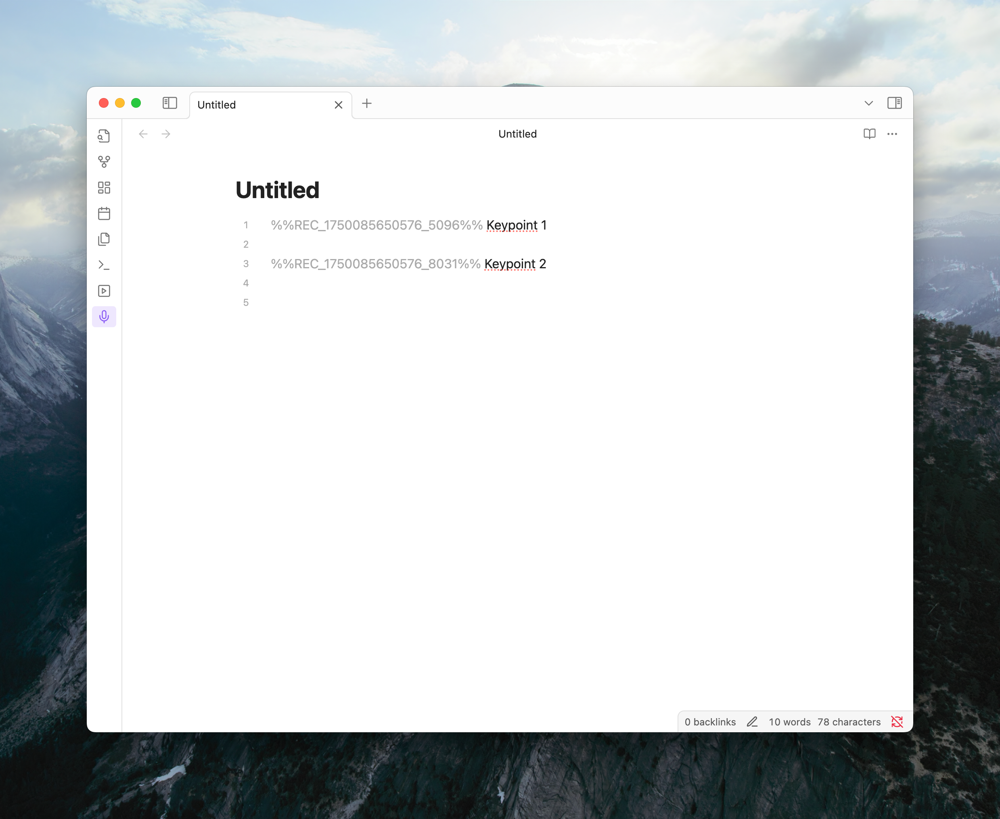
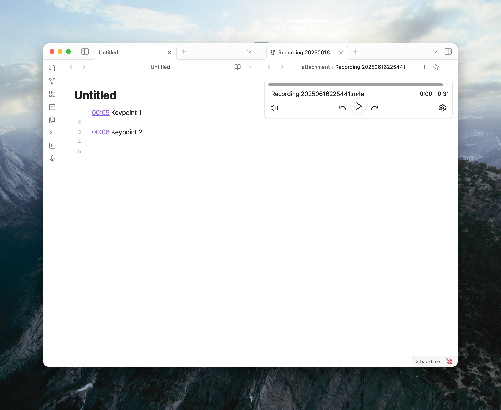

import { MicIcon } from 'lucide-react';

Taking notes during a lecture, meeting, or interview? Media Extended allows you to seamlessly timestamp your audio recordings so you can quickly jump back to key moments later.

## How It Works

The process is simple: while you're recording, you can drop timestamp placeholders into your notes. Once the recording is saved, these placeholders automatically transform into clickable links that take you to the exact second in the audio file.

### Start Recording and Take Notes

Begin recording using Obsidian's built-in **Audio recorder**. As you type your notes, use the hotkey you've configured for "Media Extended: Take timestamp on current recording" to insert a placeholder.

_A placeholder like `%%REC_...%%` is added to your note._

### Finish and Link

Once you stop the recording, the placeholders are instantly replaced with timestamps linked to the new audio file.

_Clicking `00:05` will open the recording and play it from that exact moment._

## Setup Guide

Before you can start, there are two quick things you need to set up.

### Enable the Audio Recorder

Media Extended uses Obsidian's core **Audio recorder** plugin for recordings. Make sure it's enabled before you proceed.

1. Go to `Settings` > `Core plugins`.
2. Find **Audio recorder** and turn it on.

For more details, see the [official Obsidian documentation](https://help.obsidian.md/plugins/audio-recorder).

### Set a Hotkey

There's no button for this feature in the user interface, so you'll need to set a hotkey to insert timestamps.

1. Go to `Settings` > `Hotkeys`.
2. Search for the command: `Media Extended: Take timestamp on current recording`.
3. Click the `+` icon and press your desired key combination.

<Callout title="Explore More Commands">
You can find a full list of available actions on the [Commands page](/docs/v3/reference/commands). Many of them can be assigned hotkeys for faster workflows.
</Callout>

Now you're all set to capture important moments in your recordings with ease! 