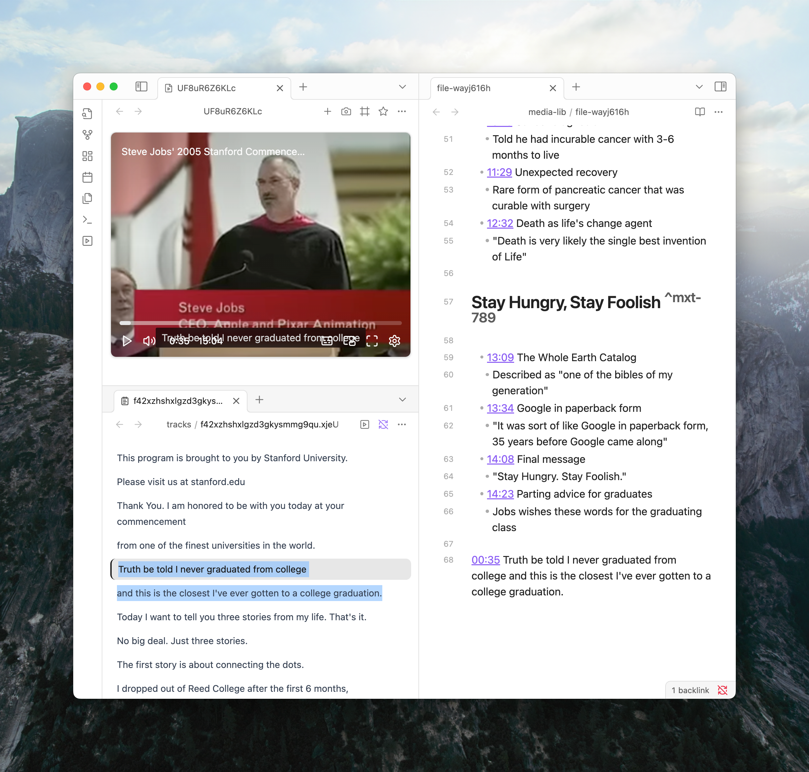
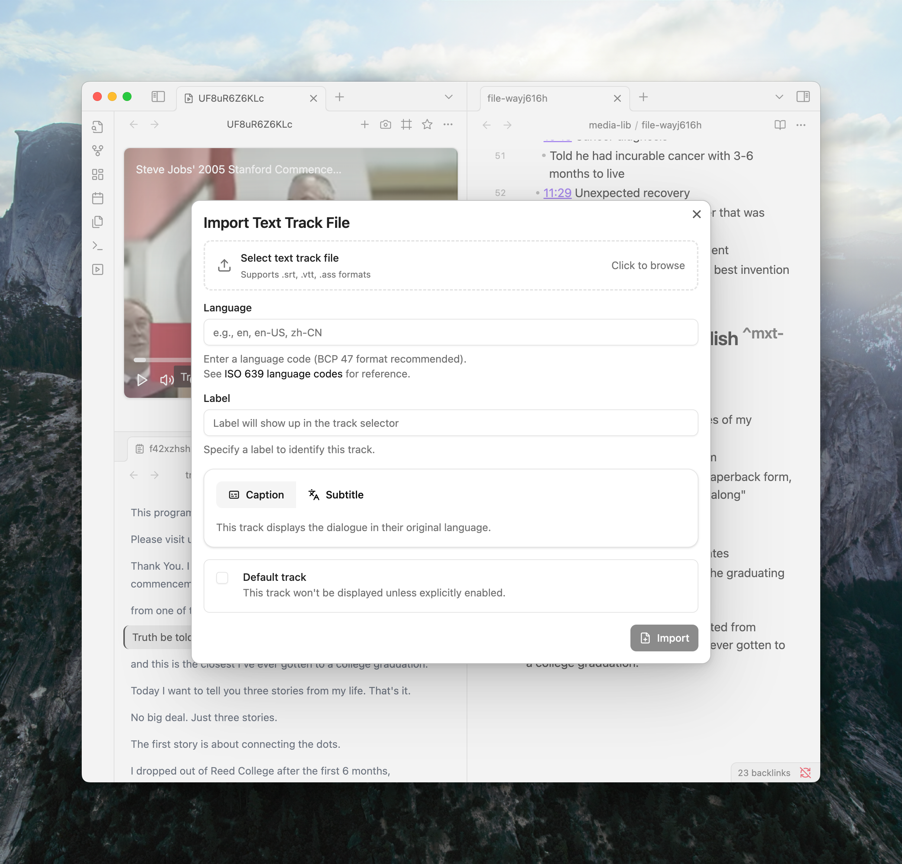
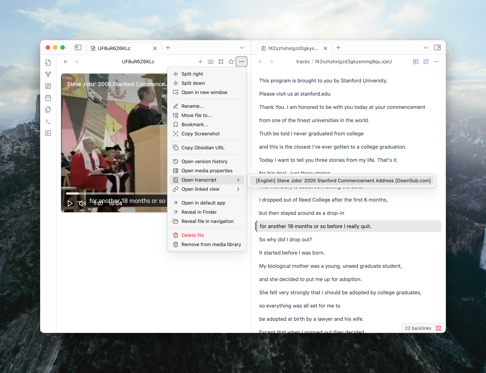
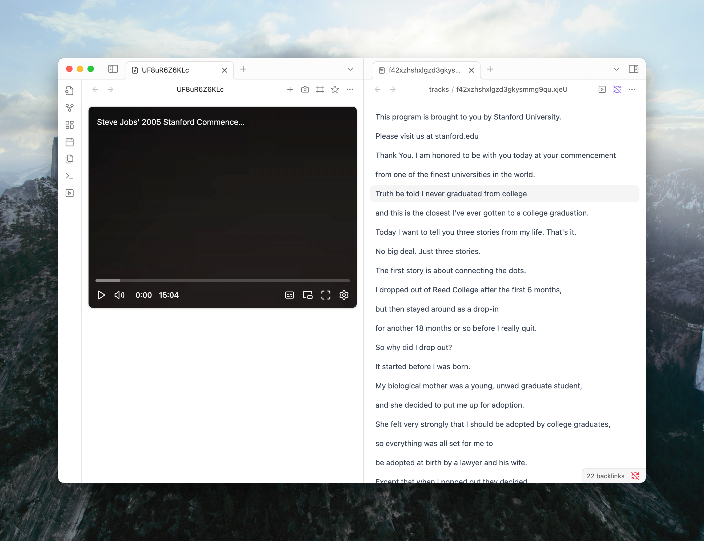

Finding a specific quote in a long lecture or podcast can be difficult. Media Extended helps by letting you link a transcript to your media, making the content searchable and navigable right inside Obsidian.



This guide shows how to add and use transcripts with your media.

## Adding a Transcript

There are two ways to get a transcript into Media Extended: by naming files smartly or by using the import wizard.

### Method 1: The Automatic Way (Same-Folder, Same-Name)

The quickest way is to place your transcript file in the same folder as your media file and give it the same name. Media Extended will find and load it automatically.

This works for both media in your vault and local files opened with a `file://` link.

**Requirements:**

- **Same Folder:** The transcript file must be in the same directory as the media file.
- **Same Name:** The transcript's filename must match the media's filename exactly (before the extension).
- **Supported Formats:** We support `.srt`, `.vtt`, and `.ass`.

**Example:**

```
/My Vault/Lectures/
├── The Future of AI.mp4
└── The Future of AI.srt
```

#### For Multiple Languages

If you have transcripts in different languages, add a BCP-47 language code before the extension.

- For English: `The Future of AI.en.vtt`
- For Simplified Chinese: `The Future of AI.zh-CN.vtt`
- For German: `The Future of AI.de.vtt`

Media Extended will use these codes to label the tracks in the player.

### Method 2: The Manual Way (Import Wizard)

Use the import wizard when your transcript files don't follow the naming convention, are in a different folder, or are hosted online.

1.  From the media player's "More options" menu (`...`), select **Add text track**.
    

2.  Choose to import **from local file** or **from remote URL**.

3.  The import wizard will appear. Fill in the details:
    
    - **Language:** Enter the language code (e.g., `en-US`, `zh-TW`). This helps with identification.
    - **Label:** A custom name for this track (e.g., "English Subtitles", "Professor's Transcript"). If you leave this blank, it will be generated from the language and kind.
    - **Kind:** Is it a `Subtitle`, `Caption`, or `Dialogue`? This helps the player display it correctly.
    - **Default track:** Check this if you want this track to be enabled by default.

4.  Click **Import**. The track is now linked to the media.

This method creates a record in Media Extended's library, so the link between the media and the transcript is remembered.

## Opening Transcripts and Linked Media

Once a transcript is linked to a media file, you can easily navigate between them.

### From Media to Transcript

When you're viewing a media file, you can open its transcript in a couple of ways:

- **From the Player:** Click the "More options" (`...`) button in the media player and select an option from the `Open transcript` submenu.
  
- **From the File Menu:** Right-click on the media file in the file explorer and choose `Open transcript`.

### From Transcript to Media

If you have a transcript file open, you can quickly jump to the linked media.

- **From the Track Panel:** Click the "Open linked media" button in the header of the transcript pane.
  

## Using the Transcript

Once a transcript is loaded, a new track pane will open alongside your media.

### Navigate with a Click

Click any line in the transcript, and the video will instantly jump to that point. No more guessing and scrubbing.

### Copy Timestamped Quotes

Select a portion of the transcript, copy it (`Cmd/Ctrl+C`), and paste it into your notes. You'll get the text along with a timestamp link that points back to that exact moment in the media.

**Example of a pasted quote:**

```md
> [00:00:35](mx-media://...) Truth be told I never graduated from college
```

<Callout type="info">
To paste just the text without the link, use `Cmd/Ctrl+Shift+V`.
</Callout>

### Full-Text Search

Need to find every mention of a specific keyword? Just click into the transcript pane and press `Cmd/Ctrl+F`. You can search the entire transcript just like any other document in Obsidian.

### Auto-Scroll and Sync

By default, the transcript highlights the current line and scrolls along with the media. If you find this distracting, you can disable it by clicking the "Stop syncing with media" button (a link icon) in the track panel's header.



<Callout type="info">
To disable this, you can check "Stop syncing with media" in the track panel.
</Callout>

## Managing Multiple Tracks

If you've added multiple transcripts (e.g., different languages), you can switch between them in the player's settings menu (the gear icon).

You can also set your preferred default languages in Media Extended's settings under `Playback > Tracks > Default Languages`. The plugin will try to automatically enable a track that matches one of your preferred languages when you open a new media file.

