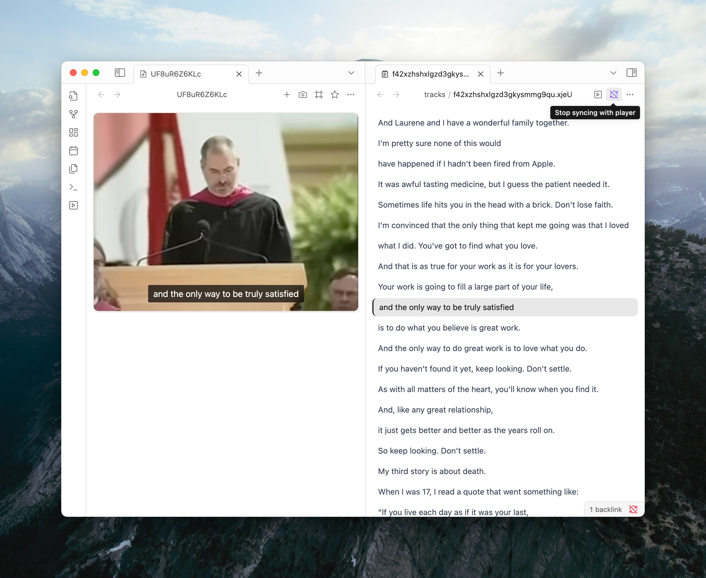

Tired of scrubbing through long recordings to find a specific moment? With Media Extended, you can link a transcript to your media. This makes your audio and video content fully searchable and easy to navigate, right inside Obsidian.

## Adding a Transcript

You can add a transcript to your media automatically or manually.

### Match the Name

The simplest method is to place your transcript file next to your media file and give it the same name.

For example, if you have `My Lecture.mp4`, name your transcript `My Lecture.srt`. Media Extended will automatically connect them.

```
/My Vault/Lectures/
├── My Lecture.mp4
└── My Lecture.srt
```

We support `.srt`, `.vtt`, and `.ass` transcript formats.

### Manual Import

What if your transcript is online or has a different name? No problem. You can use the import wizard.

1.  In the media player, click the "More options" menu (`...`) and select **Add text track**.
2.  Choose to import from a local file or a remote URL. 
3.  Fill in the details in the import wizard. You can set the language and give your track a custom label.
    - To always open media with subtitle enabled, check the "Default" checkbox.
4.  Click **Import**, and you're all set. The link between the media and transcript will be saved.


## Interactive Transcripts

Once linked, your transcript becomes a powerful navigation tool.


- **Click to Navigate**: Click any line in the transcript, and the media will jump to that exact moment.
- **Copy Timestamped Quotes**: Select text in the transcript and copy it. When you paste, you'll get the text with a special link that points back to that point in the media.
    ```md
    > [00:00:35](mx-media://...) Truth be told I never graduated from college
    ```
- **Full-Text Search**: Need to find a keyword? Just click the transcript pane and use `Cmd/Ctrl+F` to search everything.
- **Auto-Scroll**: The transcript automatically highlights the current line and scrolls as the media plays, keeping you in sync.

## Advanced Details

For those who want to customize their experience further:

- **Open Linked Media**: You can quickly open the linked media from the transcript's panel header.

- **Opening Linked Files**: You can quickly open a transcript from the media player's menu, or open the linked media from the transcript's panel header.

- **Disable Auto-Scroll**: If you prefer to scroll manually, you can disable the sync feature by clicking the "Stop syncing with media" button in the transcript panel's header.
