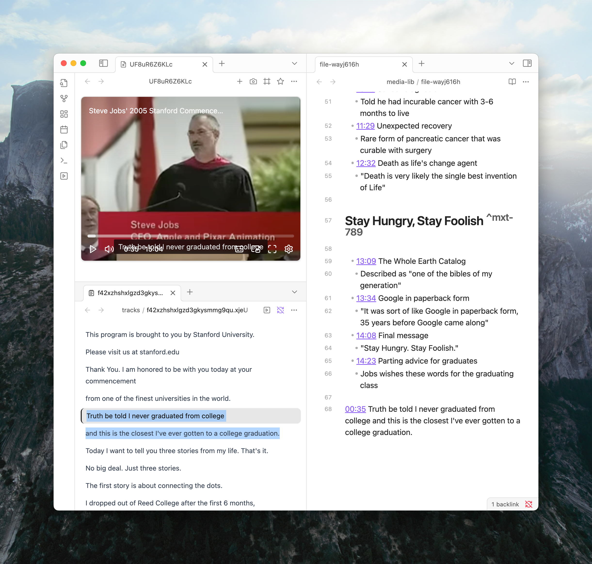

import { Library, BotMessageSquare, ScanText, Globe, FileText } from 'lucide-react'

Media Extended v4 is a significant update focused on stability, core feature enhancements, and extensibility.

## Key Features

### Redesigned Player
The media player has a new, adaptive design that adjusts to different pane sizes. The controls have been reorganized for a cleaner interface and improved usability.

### Screenshot Clipping
A clipping tool is now available when taking screenshots. This allows capturing a specific region of the video frame instead of the entire view.

### Interactive Transcript View
Subtitle and transcript files (`.srt`, `.vtt`, `.ass`) can be loaded into a new transcript view. The view highlights text as the media plays, and clicking any line seeks the media to that timestamp.

### Refactored Codebase
The plugin has been rewritten for better performance and stability, providing a more reliable foundation for future development.

## Coming Next
The following features are under development:

<Cards>
  <Card title="Media Library" icon={<Library />}>
    A central interface for managing media files and playlists.
  </Card>
  <Card title="Browser Connector" icon={<Globe />} href="/docs/v4/load-media#browser-connect">
    A browser extension to control media in websites directly in Obsidian.
  </Card>
  <Card title="AI-Powered Chapters & Summaries" icon={<BotMessageSquare />}>
    Automatic chapter generation for videos, with summaries, integrated into the player progress bar.
  </Card>
  <Card title="Transcript Generation" icon={<FileText />}>
    Automatic speech-to-text for audio and video files.
  </Card>
  <Card title="Screenshot OCR" icon={<ScanText />}>
    Extract text from screenshots using optical character recognition.
  </Card>
</Cards>
